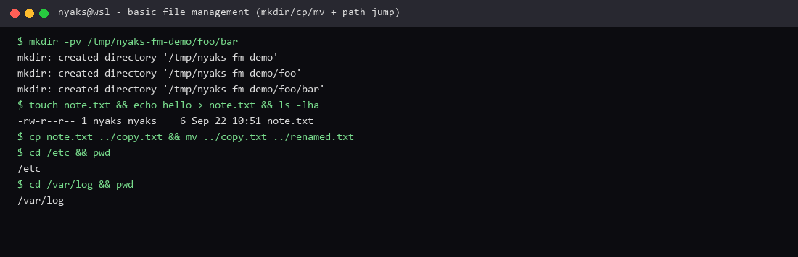

# Basic file management

**Course:** RH024 — Red Hat Enterprise Linux Technical Overview  
**Session:** Basic file management / Linux File Management (Ricardo Da Costa)  
**Logged:** 2026-09-22

## What the course covered

Managing files and directories is something you do all the time on Linux: **create, move, copy, rename, delete**. Coming from Windows or macOS the idea is the same — on Linux it is usually done from the terminal. After a short while it feels faster than the GUI.

| Command | Job |
| --- | --- |
| **`ls`** | List a directory (`ls /path/to/dir` lists another directory as the argument) |
| **`ls -l`** | Long listing — permissions, owner, size, timestamps (“l” = long) |
| **`ls -h`** | Human-readable sizes (K, M, G instead of raw bytes) |
| **`ls -a`** | Also show hidden files (names that start with `.`) |
| **`mkdir`** | Create a directory |
| **`mkdir -p`** | Create parents as needed; does not fail if the directory already exists |
| **`mkdir -v`** | Verbose — print what was done |
| **`cd`** | Change directory |
| **`touch`** | Create an empty file (or update a file’s timestamp) |
| **`cp`** | Copy a file |
| **`mv`** | Rename a file or move it to another directory |
| **`rm`** | Delete a file |
| **`rm -r`** | Delete a directory **and its contents** — use with care |
| **`rm -i`** / **`cp -i`** | Interactive — confirm before delete or overwrite |

Course style demo: `mkdir` → `touch` empty file → `ls -lha` → `cp` → `mv` to rename → `rm` to clean up. For anything destructive, slow down and check the path; `-i` helps when you want a confirm prompt.

The course also said: a GUI is fine on the desktop, but for speed and power the terminal is where these tasks get quick. Those few commands cover a large share of daily file work.

## What I liked

I liked how **easy** it is. Creating a directory or file is fast and simple — no dialog maze.

The part that clicked hardest for me: **you can jump anywhere if you know the path**.

```bash
cd /etc
cd /var/log
```

You do not have to climb one folder at a time. If you know where you want to be, you go there. Same idea for listing:

```bash
ls /var/log
```

That makes the directory layout from [Linux directories explained](linux-directories-explained.md) immediately useful: know the path, `cd` to it, manage the files.

**Why this is useful:** day-to-day work (including testing code on my laptop) is mostly create a scratch place, drop files, rename, copy, delete. When that loop is fast and boring, I can focus on the software, not the file explorer.

## What I ran on this machine

Scratch area under `/tmp`, then a path jump:

```bash
mkdir -pv /tmp/nyaks-fm-demo/foo/bar
touch /tmp/nyaks-fm-demo/foo/bar/note.txt
echo hello > /tmp/nyaks-fm-demo/foo/bar/note.txt
ls -lha /tmp/nyaks-fm-demo/foo/bar
cp /tmp/nyaks-fm-demo/foo/bar/note.txt /tmp/nyaks-fm-demo/foo/copy.txt
mv /tmp/nyaks-fm-demo/foo/copy.txt /tmp/nyaks-fm-demo/foo/renamed.txt

cd /etc && pwd
cd /var/log && pwd

rm -rf /tmp/nyaks-fm-demo
```

Re-run in WSL or any Linux shell the same way — paths will match on RHEL.



*Terminal evidence: `mkdir -pv`, write a file, `cp`/`mv`, then `cd /etc` → `cd /var/log`.*

---

*RH024 learning note — Basic file management.*
