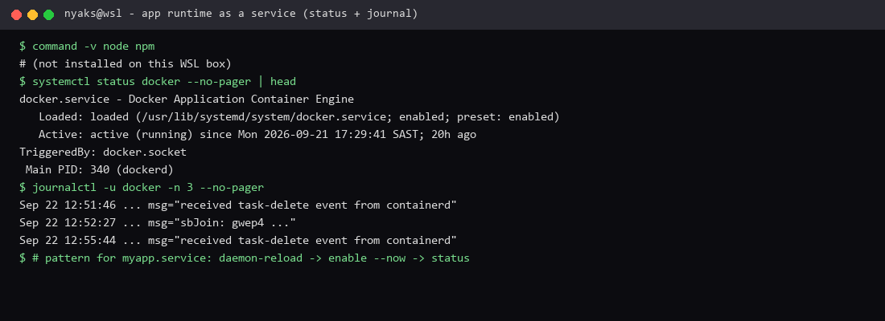

# Deploying an application runtime to host a simple application

**Course:** RH024 — Red Hat Enterprise Linux Technical Overview  
**Session:** Node.js as a systemd service / Deploying an application runtime (Ricardo Da Costa)  
**Logged:** 2026-09-22

## What the course covered

If you deploy apps on RHEL, running your code as a proper **systemd service** is a game changer:

- Starts **automatically at boot**
- **Recovers from crashes** (restart policy)
- Behaves like any other Linux service
- No more `tmux` / `screen` babysitting or remembering to relaunch after reboot

**You focus on features. systemd handles startup, restarts, and logging.**

### Flow (simple Node.js app)

1. Install the runtime (`dnf install -y nodejs`)  
2. Get the app (`git clone` the repo — course used `gitlab.com/rgdecosta/nodejsrel10`) as a normal user  
3. `npm install` (Express in their `package.json`)  
4. Custom unit file under **`/etc/systemd/system`** (`myapp.service`)  
5. Load, enable, start, verify  

### Unit file (shape from the session)

```ini
[Unit]
Description=Simple Node.js server to display a logo
After=network-online.target

[Service]
WorkingDirectory=/home/rgdaCosta/nodejsrel10
ExecStart=/usr/bin/node server.js
Restart=on-failure
User=rgdaCosta

[Install]
WantedBy=multi-user.target
```

| Idea | Why it matters |
| --- | --- |
| `After=network-online` | App starts once the network is ready |
| `WorkingDirectory` | Where the cloned app lives |
| `ExecStart` | How to run it (`node server.js`) |
| `Restart=on-failure` | Crash → come back |
| `User=` | Run as a normal user, not root (sensible) |

### Commands

```bash
sudo cp app.service /etc/systemd/system/
sudo systemctl daemon-reload
sudo systemctl enable --now myapp
sudo systemctl status myapp
```

App on **8080** → open the firewall:

```bash
sudo firewall-cmd --add-port 8080/tcp
sudo firewall-cmd --add-port 8080/tcp --permanent
```

Then test in a browser to `localhost:8080`. Fully managed: startup, restarts, logs via journal — build features instead of babysitting processes.

## What I enjoyed

As a developer, this is the piece that actually changes how I work. I care about the app; I do **not** want a second job as a process nanny.

systemd owning **start at boot**, **restart on failure**, and **logging** means:

- Deploy once → it comes back with the machine  
- Crash → policy decides what happens (here: restart)  
- Debug → `systemctl status` + journal instead of “did anyone leave a terminal open?”

Da Costa called it a game changer. From the app side of the keyboard, he is right.

**Why this is useful:** every small service I write can sit on the platform like `httpd` or `docker` — same verbs, same status, same boot behaviour. That is production-shaped, not demo-shaped.

## Terminal test capture



*Terminal evidence from this WSL machine — Node runtime check, `systemctl status` on a managed unit, and journal output (logging side).*

## What I ran on this machine

```bash
command -v node npm     # not installed on this WSL box
systemctl status docker --no-pager | head
journalctl -u docker -n 5 --no-pager
ls /etc/systemd/system | head
```

Same platform pattern as `myapp.service`: **loaded / enabled / active**, boot-managed, logs in the journal. Full `node server.js` + port 8080 belongs on a lab VM (RHEL + Node + app repo).

---

*RH024 learning note — Deploying an application runtime to host a simple application.*
