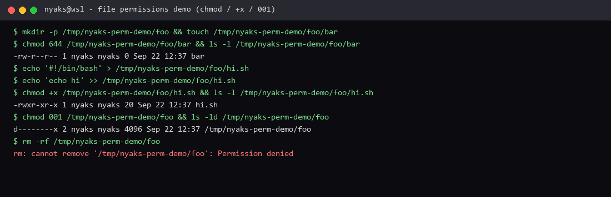

# File permissions

**Course:** RH024 — Red Hat Enterprise Linux Technical Overview  
**Session:** File permissions / Linux File Permissions (Ricardo Da Costa)  
**Logged:** 2026-09-22

## What the course covered

Ever seen **permission denied** on a file? That is Linux file permissions working. Every file and directory has rules for **who** can do **what**.

### Three permissions (and their numbers)

| Permission | Meaning | Number |
| --- | --- | --- |
| **Read (`r`)** | Read the contents | **4** |
| **Write (`w`)** | Change the contents | **2** |
| **Execute (`x`)** | Run it / enter a directory | **1** |

They add up: `4+2+1 = 7` (read + write + execute). `6` = read + write, not execute. `777` for everyone is almost never what you want on purpose.

### Three entities

Permissions are set for three parties, in this order:

1. **Owning user** (owner)  
2. **Owning group**  
3. **Other**

**“Other” does not mean everyone.** It is everyone who is **not** the owning user and **not** a member of the owning group. That trips up experienced people too.

When you create a file, you become the **owner** (creator-owner). The owning group is usually your login group unless you change it.

### What permissions you need (directories vs files)

| Task | What you need |
| --- | --- |
| `cd` into a directory | **execute** on that directory |
| List a directory’s contents | **read + execute** on the directory |
| Create or delete a file **in** a directory | **write + execute** on the **directory** (not only on the file) |
| Change a file’s contents | **write** on the file |
| Read a file | **read** on the file |
| Run a script/program | **read + execute** on the file |

Deleting a file is a write to its **directory**. Owning the file is not enough if the directory rules say otherwise.

### Changing permissions and ownership

| Command | Job |
| --- | --- |
| **`chmod`** | Change **mode** (permissions) — `chmod 005 foo`, `chmod +x hi.sh`, `chmod 007 bar` |
| **`chown`** | Change **owning user** (and group with `:`) — `chown user:group file` |
| **`chgrp`** | Change **owning group** only |

Only root (or enough privilege) can hand ownership to someone else. `chown` can set user **and** group in one go — the **colon** is how it knows `user:group`. `chgrp` only moves the group.

Course demos used paths like `foo` / `bar` and modes such as `001` (execute for other only), `005` (read+execute for other), `007` (everything for other) — then showed `permission denied` vs success when the model matched.

**Least privilege:** give only the access that is really needed. Avoid handing execute to “other” unless you must. Getting permissions right is most of keeping a system secure while still letting the right people touch the right files.

## What I enjoyed

**“Other”** finally made sense. I had always *heard* of permissions, but they felt like decoration — something that was “there” and not for me. This session wired it to real behaviour: denied vs allowed is exactly these bits.

I also got into **`chown` and `chmod` properly**. Before, my usual move was only:

```bash
chmod +x script.sh   # make a script executable
```

That is still valid — and it is exactly the execute bit. Now I understand what the bigger tools are for: numeric modes for precise sets, `chown user:group` when ownership is wrong, `chgrp` when only the group is wrong.

**Why this is useful:** every deploy, shared folder, and “why can’t this service read that config?” problem ends here. `chmod +x` is the daily habit; owner / group / other is the model underneath it.

## What I ran on this machine

Scratch files under `/tmp` (nothing system-wide):

```bash
mkdir -p /tmp/nyaks-perm-demo/foo
touch /tmp/nyaks-perm-demo/foo/bar
chmod 644 /tmp/nyaks-perm-demo/foo/bar
ls -l /tmp/nyaks-perm-demo/foo/bar

echo '#!/bin/bash' > /tmp/nyaks-perm-demo/foo/hi.sh
echo 'echo hi' >> /tmp/nyaks-perm-demo/foo/hi.sh
chmod +x /tmp/nyaks-perm-demo/foo/hi.sh
ls -l /tmp/nyaks-perm-demo/foo/hi.sh
# -rwxr-xr-x ... hi.sh

chmod 001 /tmp/nyaks-perm-demo/foo
ls -ld /tmp/nyaks-perm-demo/foo
# d--------x ... foo
# then even rm -rf failed with Permission denied until chmod was fixed again
```

That last part is the lesson in one bug: a directory with only `x` for the owner is awkward to clean up. Mode bits are not decoration.



*Terminal evidence: `chmod 644`, `chmod +x`, then `chmod 001` and `Permission denied` on delete.*

Re-run the same three ideas: numeric `chmod`, `chmod +x` for scripts, then a directory mode like `001` to feel “other” in action — and **restore the directory mode before you try to delete it**.

---

*RH024 learning note — File permissions.*
