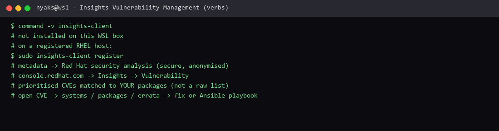

# Insights Vulnerability Management

**Course:** RH024 — Red Hat Enterprise Linux Technical Overview  
**Session:** Insights Vulnerability Management (Ricardo Da Costa)  
**Logged:** 2026-09-22

Short and to the point — this one is about **knowing which holes are real**, not drowning in CVE lists.

## What the course covered

Patching is not only `dnf update`. You need to know **what** to patch, **when** it matters, and how to **prioritise** real risk.

**Red Hat Insights** is a proactive management tool **built into RHEL**. It continuously analyses systems for security issues, misconfigurations, and compliance policies, and shows **clear, actionable advice** in the hybrid cloud console.

Instead of scrolling endless CVE lists (or waiting for a crisis), Insights shows **which vulnerabilities actually affect your systems**. It matches your **real package inventory** with Red Hat’s latest security data, so you know whether a CVE is only theoretical or **present and exploitable** on *your* hosts.

### Flow

1. System registered + Insights enabled  

   ```bash
   sudo insights-client register
   ```

2. Insights collects package metadata (sent securely, anonymised) for analysis  
3. Console → Insights dashboard → **Vulnerability** section (Inventory → Systems)  
4. Prioritised CVE list, **sorted by severity**, matched to packages on your servers  
5. Open one CVE → affected systems, packages, errata + recommended fixes  
6. Apply suggested errata; automate remediation with **Ansible playbooks** where possible  

Work this **regularly**, not only after an incident. High scores first. No surprises.

## What I enjoyed

It was **short and to the point** — and the core idea is strong: **it knows the vulnerabilities, so you do not have to know what to look for first**.

I still need CVE literacy (and OWASP on the app side), but I do not have to invent the list. Insights filters the noise down to *my* packages and *my* severity. That is triage with a map, not a firehose.

**Why this is useful:** same lesson as errata/CVEs in [Managing software and updates](managing-software-and-updates.md), one layer up — inventory × intelligence → prioritised work → patch / Ansible. Security as a process, not a panic.

## Terminal test capture



*Terminal evidence — `insights-client` registration verb and the console flow this machine does not run (not a registered Insights host).*

## What I can run here

```bash
command -v insights-client
# not on this WSL box — Insights needs a registered RHEL host
```

On a registered RHEL system (lab):

```bash
sudo insights-client register
# then: Hybrid Cloud Console → Insights → Vulnerability
```

---

*RH024 learning note — Insights Vulnerability Management.*
