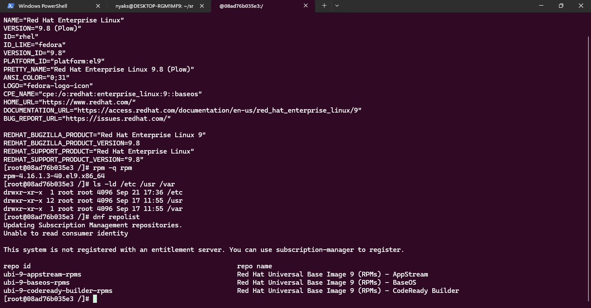
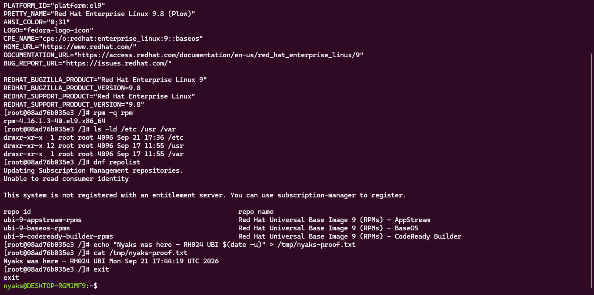

# Linux distributions

**Course:** RH024 — Red Hat Enterprise Linux Technical Overview  
**Session:** Linux Distributions Unveiled (Ricardo Da Costa)  
**Logged:** 2026-09-21

## What a distribution actually is

A Linux distribution (distro) is a complete operating system built around the Linux kernel. The kernel is the shared foundation — the central core every Linux system relies on. What separates distros is everything wrapped around that kernel: tools, applications, system defaults, package management, release cadence, and support model.

Same heart. Different bodies. That is why "Linux" is a family of products, not a single product.

## The Red Hat family: upstream to production

These distros share the Red Hat lineage, but they are not interchangeable.

| Distro | Role | Who it is for |
| --- | --- | --- |
| **Fedora** | Upstream project — cutting-edge features, experiments, latest updates | People who want the playground and accept risk |
| **CentOS Stream** | Midstream rolling preview of the next RHEL minor release | Developers and partners who want to see and influence what is coming |
| **RHEL** | Polished, enterprise-grade product | Production systems where stability, security, and support are mission-critical |

Innovation does not teleport into production. New work lands in Fedora, is previewed through CentOS Stream, then is hardened into RHEL after testing and QA. Red Hat's design bet is balance: innovate without sacrificing reliability.

## Package managers shape your whole software experience

- **RHEL, CentOS Stream, Fedora:** RPM package manager (a veteran; RPM dates back to 1997). Install, update, remove — `rpm` / `dnf` territory.
- **Debian / Ubuntu:** APT and dpkg.

RPM packages are not compatible with APT packages and vice versa. The distro also decides what ships out of the box (Python, Node.js, GCC, Java, and so on). The package manager is not a footnote — it shapes almost every day on the machine.

## Predictability and support

- New major RHEL versions roughly every **three years**
- Upgrade tooling (Leap) exists to make major jumps smoother
- Support runs in phases:
  1. **Full support** — about the first five years: features, bug fixes, security updates
  2. **Maintenance support** — the next stretch: mainly security patches
  3. **Extended update support** — optional add-on for selected security patches after the first two phases

Other distros optimise differently. Red Hat optimises for planning and the long haul.

## What I enjoyed: open source means it can be mine

This is the part I liked most, so I am writing it in plain words.

Almost everything in a Linux distribution is open source. That is not only "free as in price." It means:

1. **I can look at the code** — the system is not a black box.
2. **I can change it** — tweak behaviour to fit how I work.
3. **I can share the improvement** — if my change helps others, it can re-enter the ecosystem.

No costly or restrictive licence sitting between me and the system I run.

Red Hat does not only consume open source; it contributes back. Innovations such as **systemd**, **KVM**, and **Tuned** started in this world and now power many other distributions too. The ecosystem stays healthy because borrowing, learning, and building on each other's work are normal.

**Why this is useful:** open systems let you inspect, repair, and adapt what you run. That is practical for day-to-day Linux work — debugging, automation, and understanding what a machine is actually doing — not just a nice idea.

## Flexibility and standards

- Want a full desktop? GNOME is available.
- Prefer headless servers and the command line? Also valid.
- Red Hat follows the **File Hierarchy Standard (FHS)**: paths like `/etc`, `/usr`, and `/var` sit where you expect. Not every distro sticks to standards 100%; Red Hat does it for predictability and easier troubleshooting.

Shared tools and kernels do not mean identical day-to-day experience. Defaults, configuration, and release schedule change how the machine feels — like two cars built from similar parts but tuned very differently.

## What I ran on this machine

| Date | What | Result |
| --- | --- | --- |
| 2026-09-21 | Downloaded `rhel-9.8-x86_64-boot.iso` | 1,440 MB on disk |
| 2026-09-21 | Mounted ISO on Windows | Drive `D:`, label `RHEL-9-8-0-BaseO`, contents `EFI/`, `images/`, `isolinux/` |
| 2026-09-21 | Ran Red Hat UBI9 in Docker (WSL) | `os-release` reports **Red Hat Enterprise Linux 9.8 (Plow)** |
| 2026-09-21 | Commands in the container | `rpm -q rpm` → `rpm-4.16.1.3-40.el9.x86_64`; `/etc`, `/usr`, `/var` present; `dnf repolist` listed UBI repos |
| 2026-09-21 | Wrote a file on that RHEL filesystem | `echo "Nyaks was here — RH024 UBI $(date -u)" > /tmp/nyaks-proof.txt` then `cat` returned the same line |

Re-run:

```powershell
wsl -d Ubuntu -- docker run --rm -it registry.access.redhat.com/ubi9/ubi:latest bash
```

```bash
cat /etc/os-release
rpm -q rpm
ls -ld /etc /usr /var
dnf repolist
echo "Nyaks was here — RH024 UBI $(date -u)" > /tmp/nyaks-proof.txt
cat /tmp/nyaks-proof.txt
exit
```

UBI is the free RHEL userspace container image — useful for trying RHEL tooling without installing a full VM.

### Screenshot evidence



*Session in `ubi9/ubi` — RHEL 9.8 (Plow), `rpm-4.16.1.3-40.el9`, FHS paths, UBI repos.*



*Wrote `/tmp/nyaks-proof.txt` on the RHEL filesystem and read it back.*

---

*RH024 learning note. Transcript slips corrected for the written record: "System B" → **systemd**; "Center Stream" → **CentOS Stream**; path names like "Etsy / USR / bar" → **`/etc` / `/usr` / `/var`**.*
