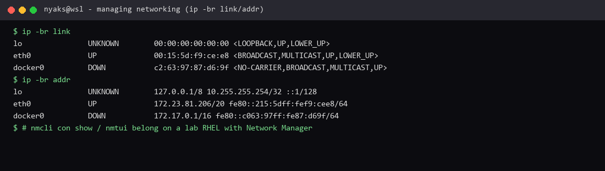

# Managing networking

**Course:** RH024 — Red Hat Enterprise Linux Technical Overview  
**Session:** Managing networking / Network Manager Basics (Ricardo Da Costa)  
**Logged:** 2026-09-22

## What the course covered

Networking on Linux is made easier by **Network Manager**. Devices show up as **interfaces** with hardware-based names (`eno`, `enp`, `wlp` style — e.g. `enp7s0`). Settings live in **profiles** (sometimes called **connections**). Each profile is a set of properties for **one interface**, and an interface can have only **one active profile** at a time.

### Tools

| Tool | What it is |
| --- | --- |
| **`nmcli`** | Command-line manager (`nmcli con show` / `nmcli cs`, add/edit/delete profiles) |
| **`nmtui`** | Text-based menu in the terminal (course demo of the “user-friendly” path) |
| **`nmcli` + Tab** | Tab-complete until the line is unique — useful when the command surface feels large |

Course flow for a **static IPv4** profile (example name `datacenter` on `enp7s0`):

- Connection name, ethernet type, target interface  
- IPv4 method **manual** (static)  
- IP `192.168.1.114/24`, gateway `192.168.1.1`  
- DNS `192.168.1.1` and `1.1.1.1`  
- Verify: `nmcli con show`, `ip address show`, `ip route show`, `/etc/resolv.conf`  

Gone are the days of only editing config files and hoping for no typos — Network Manager centralises that work.

### Scope (honest)

This session is about the **tool**, not a full networking theory course. It did **not** dive into TCP/UDP, IPv4 vs IPv6 trade-offs, or the OSI / networking models. Those are still worth learning later; here the win is: create a profile, set an address, verify the link.

## What I enjoyed

I loved how much **complexity is removed**. One place for profiles, clear add/edit/delete, and verification commands that just report what is live.

The **text UI (`nmtui`)** is the part I would show a beginner. When you are new, long `nmcli` lines are easy to mistype. A menu that adds, edits, and removes profiles **without remembering every option** means fewer mistakes while you are still learning the model. GUI or TUI is not “less serious” — it is a safety rail until the commands feel natural.

**Why this is useful:** every server that must be reached over the network starts here. Static lab boxes, home labs, later any infra work — if you can set IP, gateway, and DNS with Network Manager and **verify** them, you stop fearing “the network broke.”

## Screenshots from testing here



*Terminal evidence: `ip -br link` and `ip -br addr` on this WSL machine (`lo`, `eth0`, `docker0`).*

## What I can run here

Read-only on this WSL machine (no production NIC reconfiguration):

```bash
ip -br link
ip -br addr
nmcli con show 2>/dev/null || true
command -v nmtui nmcli 2>/dev/null
```

On this WSL box `ip -br link` / `ip -br addr` work; full Network Manager profile work belongs on a lab RHEL/VM. The course pattern:

```bash
sudo nmtui          # menu path
sudo nmcli con add type ethernet con-name datacenter ifname enp7s0
sudo nmcli con mod datacenter ipv4.method manual
sudo nmcli con mod datacenter ipv4.addresses 192.168.1.114/24
sudo nmcli con mod datacenter ipv4.gateway 192.168.1.1
sudo nmcli con mod datacenter ipv4.dns "192.168.1.1 1.1.1.1"
sudo nmcli con up datacenter
ip addr show enp7s0
ip route show
cat /etc/resolv.conf
```

---

*RH024 learning note — Managing networking (Network Manager).*
