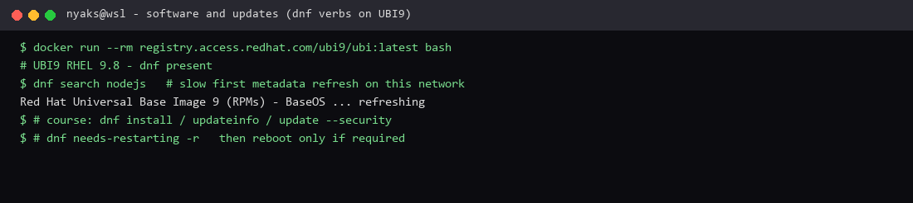

# Managing software and updates

**Course:** RH024 — Red Hat Enterprise Linux Technical Overview  
**Session:** Managing software and updates / System Security and Updates (Ricardo Da Costa)  
**Logged:** 2026-09-22

## What the course covered

Installing apps is only the start. **Real system health** is staying on top of **updates**. The course walked registration → `dnf` install → errata (including CVEs) → apply updates → check if a reboot is needed.

### Getting software from the official repos

On a registered system (or via **Satellite** as a local proxy of the Red Hat content delivery network):

```bash
dnf search nodejs
dnf install nodejs
```

`dnf install` does **automatic dependency resolution** — if Node.js needs docs, i18n, npm-related packages, dnf pulls them in and shows the transaction before you agree.

```bash
dnf install -y nodejs    # skip the yes/no prompt
```

**`-y` is convenient and a bit dangerous** — you can install packages you did not read. On important systems, read the transaction list first.

### Updates come as errata

Three types:

| Type | Meaning |
| --- | --- |
| **RHBA** | Red Hat **Bug Fix** Advisory |
| **RHEA** | Red Hat **Enhancement** Advisory |
| **RHSA** | Red Hat **Security** Advisory — the urgent one |

```bash
dnf updateinfo list
dnf updateinfo info RHSA-2025-10854   # one advisory in detail
```

An advisory lists what it fixes — including **CVE IDs**.

### CVEs (and why that matters)

**CVE** = **Common Vulnerabilities and Exposures**. Vendor-neutral IDs the whole industry uses (Red Hat, Microsoft, Cisco, Debian, …).

If a package is hit by a known issue you also get a **CVSS** score for seriousness — e.g. **5.5** moderate, **9.8** critical. One RHSA can cover several CVEs (example from the session: **CVE-2025-22-036** style IDs on kernel packages).

```bash
dnf update                    # full system
dnf update --security         # security updates only
dnf update --sec-severity=important
dnf update --sec-severity=critical
```

After updates, check whether a **reboot** is required (kernel, core libs):

```bash
dnf needs-restarting -r
reboot    # only when needed, at a sensible time
```

If `dnf needs-restarting -r` prints nothing — you are done. If it lists kernel/core, plan a short reboot to finish the job.

## What I enjoyed

**CVEs** landed hard for me. I already know the **OWASP Top 10** side of security (web/app risks). Seeing Linux updates talk in **CVE IDs and CVSS scores** is the same culture on the platform layer: named threats, severity, and a vendor-neutral way to say “this is the hole we are closing.” It shows the ecosystem takes security as a **process** (advisories, errata, severity filters), not as a vibe.

**`dnf` install** was the other highlight. Search → install → dependencies resolved for me → confirm → done. Compared to hunting installers by hand, that is a short loop:

```bash
dnf search nodejs
dnf install nodejs
```

**Why this is useful:** OWASP teaches *what* can go wrong in apps. Errata/CVE workflow teaches *how* a platform team stays patched day to day. Together: write safer software **and** keep the OS under it current. Easy installs are nice; **easy, tracked updates** are the real product.

## What I can run here

UBI9 (RHEL userspace) in Docker is available on this machine; `dnf` is there. A full `dnf search` needs to refresh repo metadata and was **slow on this network** when I tried — that is a normal first-run cost, not a broken dnf.

Commands to run on UBI or (better) a registered RHEL system, same as the course:

```bash
dnf search nodejs
dnf install nodejs
dnf updateinfo list
dnf update --security
dnf needs-restarting -r
```

Full errata against the official CDN needs **subscription-manager** (or Satellite). Until then, UBI is enough to practise the verbs: **search → install → list advisories → update → reboot check**.



*Terminal evidence: UBI9 `dnf` context and the update/reboot-check commands from the course.*

---

*RH024 learning note — Managing software and updates.*
