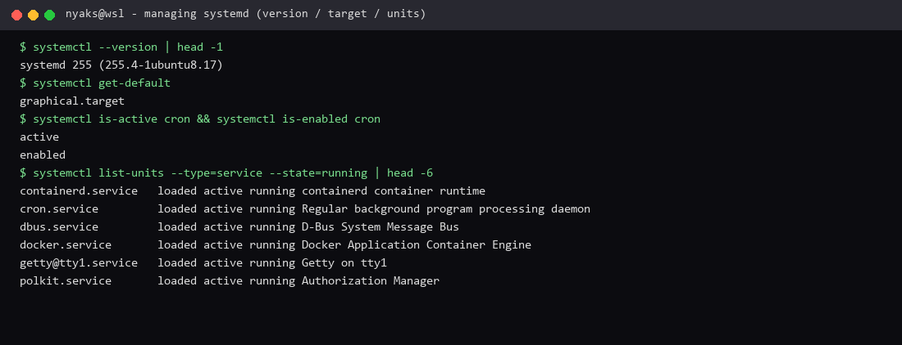

# Managing system startup services with Systemd

**Course:** RH024 — Red Hat Enterprise Linux Technical Overview  
**Session:** Managing Services with Systemd (Ricardo Da Costa)  
**Logged:** 2026-09-22

## What the course covered

**systemd** is the boss that decides **what starts when** and **in what order** on a Linux system. If you manage services, you are using systemd (and **`systemctl`**).

Almost everything systemd manages is a **unit**:

| Unit type | Job |
| --- | --- |
| **Service** | Run applications / daemons |
| **Socket** | Activate something on demand |
| **Timer** | Schedule tasks |
| **Path** | Watch files or directories |
| **Target** | Group units (one of the instructor’s favourites) |

systemd is a Red Hat contribution to open source and is used by major distributions today.

### Core `systemctl` verbs (httpd example from the course)

```bash
sudo dnf install -y httpd
echo 'hello world' > index.html          # default web document
sudo systemctl start httpd               # run now
sudo systemctl enable httpd              # also at every boot
sudo systemctl enable --now httpd        # start + enable in one step
sudo systemctl status httpd              # running? enabled at boot?
```

`.service` is optional in the unit name (`systemctl start httpd` works).

| Command | Meaning |
| --- | --- |
| `systemctl restart httpd` | Reload after config changes (no full reboot) |
| `systemctl stop httpd` | Stop **right now** (troubleshooting / maintenance) |
| `systemctl disable httpd` | Do **not** start again on the **next boot** |

**stop vs disable:** stop holds the service down *now*; disable keeps it from coming back with the system. Together you get **predictable, controlled startup** — no surprises.

### FirewallD (so the web server is actually reachable)

FirewallD is the gatekeeper (zones + service names). HTTP = TCP 80:

```bash
sudo firewall-cmd --add-service http
sudo firewall-cmd --add-service http --permanent   # survive reboot
sudo firewall-cmd --list-all
```

Course tip: `!! --permanent` can re-run the previous command with `--permanent` appended (the shell shows what it expands to).

## What I enjoyed

I love that systemd can **just start things**. First thing I need — my terminal stack, a service I depend on — can be **up at boot** so I do not waste time and jump straight into work.

That is the difference between a box that is “on” and a box that is **ready**. Enable what you need once; every boot after that is the same machine you left. Predictable startup is a time tool as much as a sysadmin tool.

**Why this is useful:** daily drivers (SSH, Docker, local services) enabled once; lab services started/stopped cleanly; after a config tweak, `restart` instead of rebooting the world. Stop = now. Disable = next boot. Learn those two and half the mystery of “why does this keep coming back?” is gone.

## Terminal test capture



*Terminal evidence from this WSL machine — `systemctl` version, default target, and a sample unit state.*

## What I ran on this machine

```bash
systemctl --version
systemctl get-default
systemctl is-active cron
systemctl is-enabled cron
systemctl list-units --type=service --state=running | head
```

WSL is not a full RHEL service lab (no `httpd`/`firewall-cmd` course stack here). On a lab VM, use the httpd + firewall-cmd pattern above.

---

*RH024 learning note — Managing system startup services with Systemd.*
