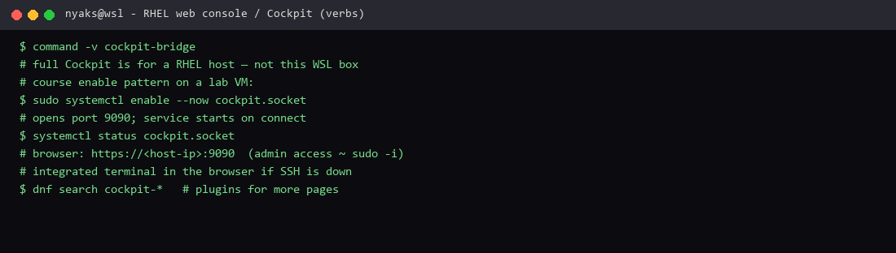

# Managing systems with the RHEL web console

**Course:** RH024 — Red Hat Enterprise Linux Technical Overview  
**Session:** Managing systems with the RHEL web console / RHEL Web Console Benefits (Ricardo Da Costa)  
**Logged:** 2026-09-22

Also called **Cockpit**. Web dashboard built into RHEL — admin from any browser, including a phone.

## What the course covered

Work smarter: tools that cut time to market, human error, and friction. Cockpit is one of them.

| Area | What you see / do |
| --- | --- |
| **Health** | Failed services, security updates, Insights hits, last successful login |
| **Metrics** | CPU / memory history |
| **Logs** | Filter by time and priority (e.g. last 7 days, critical and above) |
| **Storage** | RAID, LVM, Stratis pools — without memorising long commands |
| **Services / users** | systemd units, accounts |
| **Networking / firewall** | Same ideas as `nmcli` / `firewall-cmd`, in UI form |
| **Updates** | Install applicable updates from the browser |
| **SELinux** | Manage something many people find painful |
| **Files / apps** | File browser, Node.js app files, containers, VMs |
| **Integrated terminal** | Full shell **in the browser** if SSH is down or firewall rules are messy |
| **Multi-host** | Add servers to one Cockpit dashboard and switch between them |
| **Extras** | Terminal session recording, plugins (`dnf search cockpit-*`) |

### Enable (one-liner)

```bash
sudo systemctl enable --now cockpit.socket
```

Opens **port 9090** and starts the service when someone connects. Browser → `https://<host>:9090` (trusted cert optional). Log in with your normal user; turn on **administrative access** — same idea as `sudo -i`.

**Security note from the course:** convenience without a new hidden API or backdoor. Cockpit drives the **same standard tools** under the hood. Not a second, secret control plane.

Plugins when you want more:

```bash
dnf search cockpit-*
sudo dnf install -y cockpit-*
```

## What I enjoyed

I am a **terminal person** — but this session sold **mobility**. A browser on any device is a console to the server: check health from your phone, open logs with filters, fix a service, even drop into a full terminal when SSH is broken.

That is not leaving the CLI behind. It is **bringing the CLI and the platform with you** (integrated terminal included). Newcomers get a visual path; experienced admins get speed and remote reach.

**Why this is useful:** one place for health + updates + storage + networking + VMs + containers; multi-host from one dashboard; break-glass terminal in the browser. Same verbs as we learned in the systemd / networking notes — fewer mouse-miles, more control.

## Terminal test capture



*Terminal evidence — `cockpit.socket` enable pattern and a tool check on this WSL machine.*

## What I can run here

```bash
command -v cockpit-bridge
# full Cockpit is for a RHEL (or compatible) host — not this WSL box
```

On a lab RHEL VM:

```bash
sudo systemctl enable --now cockpit.socket
systemctl status cockpit.socket
# browser: https://<host-ip>:9090
```

---

*RH024 learning note — Managing systems with the RHEL web console (Cockpit).*
