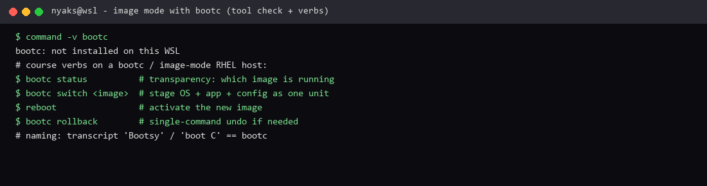

# Using Image Mode with Bootc

**Course:** RH024 — Red Hat Enterprise Linux Technical Overview  
**Session:** Using Image Mode with Bootc (Ricardo Da Costa)  
**Logged:** 2026-09-22

Naming note: the transcript sometimes says “Bootsy” / “boot C”. The tool is **`bootc`** (bootable containers / image mode). Commands start with `bootc` — e.g. `bootc status`, `bootc switch`.

## What the course covered

Traditionally you install the OS, then layer updates, apps, and configs step by step. Each server drifts. Patching and troubleshooting get messy — you are not always sure what is actually under the hood.

**Image mode with `bootc`** flips that: run a **complete system image** (OS + apps + configuration) instead of building a server piece by piece.

| Old path | Image mode (`bootc`) |
| --- | --- |
| Install OS → add packages → edit configs → patch one by one | Build **one image** that already contains OS + app + settings |
| Servers drift apart | Same image = known contents |
| Upgrade = hope | Build a **new image**, point the host at it, **reboot** |
| Undo = archaeology | **Roll back** to the previous image with a single command |

Updates at once: operating system, applications, even configuration files. No guesswork, no hidden surprises. If something goes wrong → roll back fast.

### Course demo shape (RHEL 10 + Apache in the image)

1. Host already booted from an image (web server baked in).  
2. **`bootc status`** — see the image that is running (version 1).  
3. **`bootc switch`** to a new image URL (e.g. a path like `...bootchttpd2` / version 2).  
4. Host pulls the new image and stages it.  
5. **`reboot`** — now version 2 is live (browser shows the new page/logo band).  
6. If needed: **roll back** to the previous image with one command.

The point of `bootc status` is **transparency**: you can say what is running on the server instead of guessing which layer won last week.

## What I enjoyed

Three things stuck:

1. **Roll back** — a single command is a safety net. Upgrades stop being scary.  
2. **Updates made easy** — new image → switch → reboot. OS + app + config move together.  
3. **Transparency** — knowing *exactly* what is running on your servers. Confidence beats folklore.

That last one is the real product: **predictable servers**. Image mode makes “what is this box?” an answerable question.

**Why this is useful:** fewer snowflake machines, faster recovery, and an audit-friendly story (this image ID is production). It is infrastructure thinking — the same impulse as selling the shovel: control the platform, not just one app on top of it.

## Terminal test capture



*Terminal evidence from this WSL machine — `bootc` is **not** installed here; capture records the check and the course verbs for a lab host.*

## What I ran on this machine

```bash
command -v bootc
# not installed on this WSL box
```

On a bootc-capable RHEL 10 host (lab):

```bash
bootc status
bootc switch <image-ref>
reboot
bootc rollback    # if version 2 misbehaves
```

---

*RH024 learning note — Using Image Mode with Bootc (`bootc`, not “Bootsy”).*
